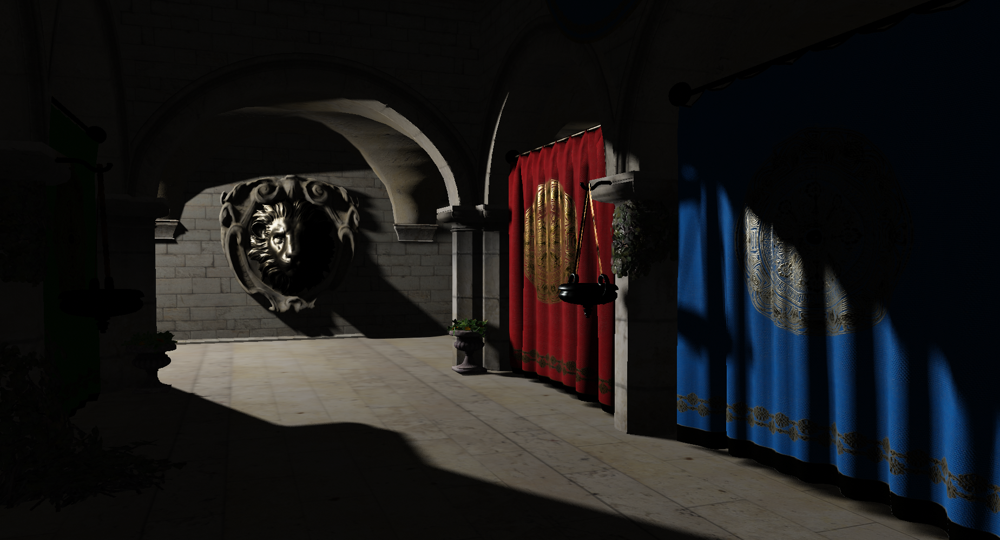
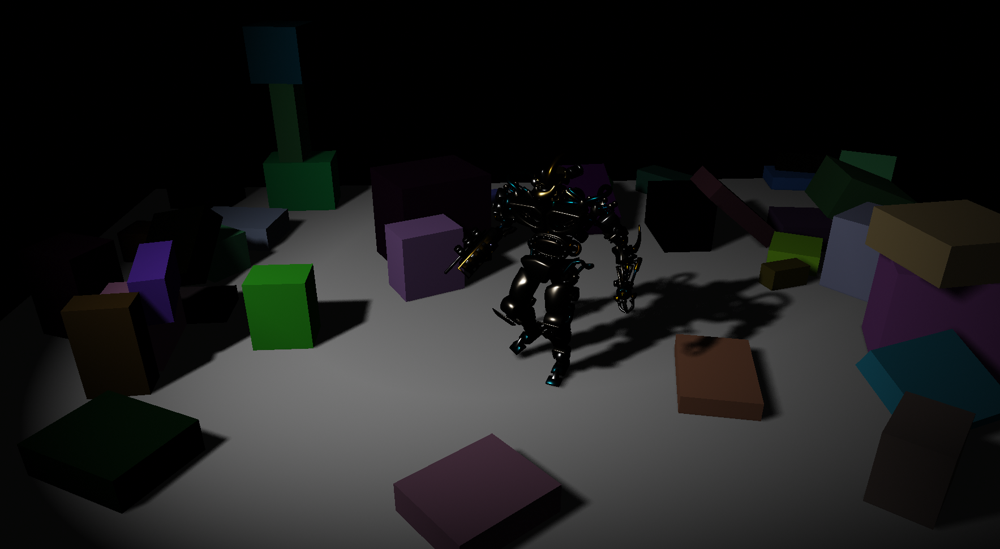

# MiteVox

MiteVox is a 3D game engine (or rather a game framework so far). 
The engine is a result of experiments in Computer Graghics, Machine Learning and Computer Science in general.

## How to build
The project is built with ``Visual Studio 2022``.

## Potential use cases
:video_game: Sandbox games

:rocket: Approximate physics simulations

:robot: AI's virtual playground

## Screenshots

[Sponza](https://github.com/KhronosGroup/glTF-Sample-Models/tree/master/2.0/Sponza) atrium

[BrainStem](https://github.com/KhronosGroup/glTF-Sample-Models/blob/master/2.0/BrainStem) and physically scattered boxes

## Structure & features

### engine / MiteVox
- API file: MiteVoxAPI.h
The core of the engine. It defines the **entry point**.
- Skeletal animations
- Morph target animations (per-vertex animations)
- engine_config.json

### engine / Renderer
- API file: RendererAPI.h
- Rendering APIs: OpenGL
- Deferred rendering
- Multiple lights
- Light types: Point-light, Directional light, Spot-light
- Shadow maps for Point-light, Spot-light
- Several shadow maps are rendered per draw call (via layered rendering)
- PBR

### engine / FileIO
- API file: FileInputOutput.h
- Contains implementation of asynchronous file loader & parser.

### engine / Math
- Vectors, Matrices, Quaternions
- Data structures: Buffer, Half-table
- Graphs:
  - Trees: Binary search tree, Octree
- 3D collision detection using Hyperplane Separation Theorem
- Convex hull generation from a mesh
- Mesh decimation

### engine / Physics
- 3D rigid body simulation using Newtonian physics
- 3D rigid body simulation using Position Based Dynamics
- Object sleeping

### engine / AIModels
- ML-models:
  - Feedforward Neural Networks
    - FullyConnectedLayer (+ backpropagation)
    - SubsamplingLayer2D
    - SoftmaxLayer
  - Recurrent Neural Networks
    - HopfieldNetwork
  - NeuralNetwork: class that joins different types of NNs

### engine / UIEventHandler
- Has a basic user I/O setup.

## External dependencies (included)
- [GLEW (The OpenGL Extension Wrangler Library)](https://github.com/nigels-com/glew)
- [GLFW (A multiplatform library for OpenGL)](https://github.com/glfw/glfw)
- [GLM (A header only C++ mathematics library)](https://github.com/g-truc/glm)
- [stb (stb_image.h, stb_image_write.h)](https://github.com/nothings/stb)

## References
1. [Learn OpenGL](https://learnopengl.com)
2. [Detailed Rigid Body Simulation with Extended Position Based Dynamics](https://matthias-research.github.io/pages/publications/PBDBodies.pdf)
3. [McGuire Computer Graphics Archive](https://casual-effects.com/g3d/data10/index.html)
4. [A Simple Entity Component System. Austin Morlan](https://austinmorlan.com/posts/entity_component_system)
5. [JSON Standard (ECMA 404)](https://www.ecma-international.org/publications-and-standards/standards/ecma-404/)
6. [Neural networks. 3Blue1Brown](https://www.youtube.com/watch?v=aircAruvnKk&list=PLZHQObOWTQDNU6R1_67000Dx_ZCJB-3pi)
7. [Backpropagation in Convulutional Neural Networks from Scratch](https://www.youtube.com/watch?v=z9hJzduHToc)
