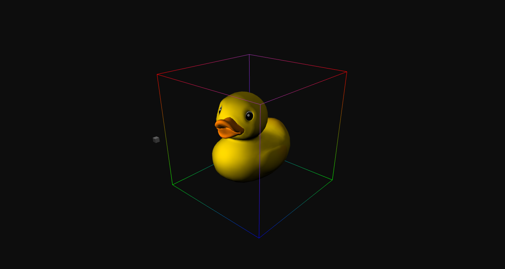

# MiteVox

MiteVox is a game engine (or rather a game framework so far). 
The engine is a result of experiments in Computer Graghics, Machine Learning and Computer Science in general.

## How to build
The project is built with ``Visual Studio 2022``.

## Potential use cases
:video_game: Sandbox games

:rocket: Approximate physics simulations

:robot: AI's virtual playground

## Screenshots
Custom scene               | Duck from [glTF 2.0 Sample Models](https://github.com/KhronosGroup/glTF-Sample-Models/tree/master/2.0)
---------------------------|-----------------------------------
 | 

## Structure, features & TODO
:warning: - TODO

### Custom project(s)
The solution contains an example project: `sandbox / DemoProject`
- engine_config.json

### engine / MiteVox
The core of the engine. It defines the **entry point**.
- Scene
- Scene serialization: :warning:glTF, :warning:CBOR
- Scripting: Native (C++), :warning:Lua

### engine / ECSManager
A custom Entity-Component-System. It's minimalistic.
- Entity Component System
- Prefabs
- :warning:Hierarchy

### engine / FileIO
Contains the implementation of an object that reads and parses files asynchronously.
- Asynchronous file loader & parser
- Graphics: PNG, :warning:glTF, OBJ, :warning:MTL
- Data interchange formats: JSON, :warning:CBOR
- Audio files: :warning:MP3
- Container formats: :warning:Ogg, :warning:ZIP

### engine / Math
- Data structures: Buffer, Half-table
- Linear algebra: Point3D, Vector3D, :warning:Matrices
- Numerical analysis:
  - Interpolation: Linear
- Graphs:
  - Trees: Binary search tree, Octree, :warning:Quad tree
- Noise: :warning:Perlin, :warning:OpenSimplex

### engine / Renderer
Currently supports only OpenGL.
- Primitives: Point, Line, Triangle
- :warning:Sprites
- Skybox
- Model3D
- Material:
  - Texture maps: Albedo, Roughness, Metallic, :warning:Normal, :warning:Glow
  - :warning:.mtl parser
- Camera:
  - :warning:Focal length
- :warning:Multiple cameras
- Lights: Ambient, Directional, Point light, :warning:Spot light
- Multiple lights
- :warning:PBR

### engine / AIModels
- ML-models:
  - Feedforward Neural Networks
    - FullyConnectedLayer (+ backpropagation)
    - :warning:ConvolutionalLayer2D (:warning:backpropagation)
    - SubsamplingLayer2D (:warning:backpropagation)
    - SoftmaxLayer (:warning:backpropagation)
  - Recurrent Neural Networks
    - HopfieldNetwork
    - :warning:LongShortTermMemory
  - Spiking Neural Networks
    - Electrical
      - :warning:Hodgkin–Huxley model
      - Integrate-and-fire: :warning:Leaky, :warning:Adaptive, :warning:Fractional-order leaky, :warning:Exponential, :warning:Adaptive exponential.
  - NeuralNetwork (class that joins different types of NNs)
- Pathfinding:
  - :warning:A*
- :warning:StateMachine

### engine / Physics
Has an implementation of AABB collisions and defines rigid body.
- Colliders:
  - Primitive collider
    - AABB intersection
    - :warning:SAT intersection
  - :warning:Mesh collider
- Structures: Rigid body, :warning:Atoms
- Classical mechanics: Kinematics, :warning:Dynamics, :warning:Statics

### engine / UIEventHandler
Has a basic user I/O setup. It definitely needs redesign...

## :bug: Known bugs & limitations :bug:
- [X] ~~The project requires switching between release and debug via a flag~~.
- [ ] If you assign light position to a camera position, z-component needs to be negated (why?).
- [ ] .obj parser doesn't support polygon grouping by material.
- [ ] .obj parser doesn't support polygon grouping by smoothing.
- [ ] Binary search tree has global variables.
- [ ] Transform::getDirectionVector() + SpotLight doesn't work as expected.
- [ ] The project should be built with CMake.

## External dependencies (included)
- [GLEW (The OpenGL Extension Wrangler Library)](https://github.com/nigels-com/glew)
- [GLFW (A multiplatform library for OpenGL)](https://github.com/glfw/glfw)
- [GLM (A header only C++ mathematics library)](https://github.com/g-truc/glm)
- SOIL (Simple OpenGL Image Library)

## References
1. [Learn OpenGL](https://learnopengl.com)
2. [Some materials](http://www.it.hiof.no/~borres/j3d/explain/light/p-materials.html)
3. [McGuire Computer Graphics Archive](https://casual-effects.com/g3d/data10/index.html)
4. [A Simple Entity Component System. Austin Morlan](https://austinmorlan.com/posts/entity_component_system)
5. [JSON Standard (ECMA 404)](https://www.ecma-international.org/publications-and-standards/standards/ecma-404/)
6. [Neural networks. 3Blue1Brown](https://www.youtube.com/watch?v=aircAruvnKk&list=PLZHQObOWTQDNU6R1_67000Dx_ZCJB-3pi)

