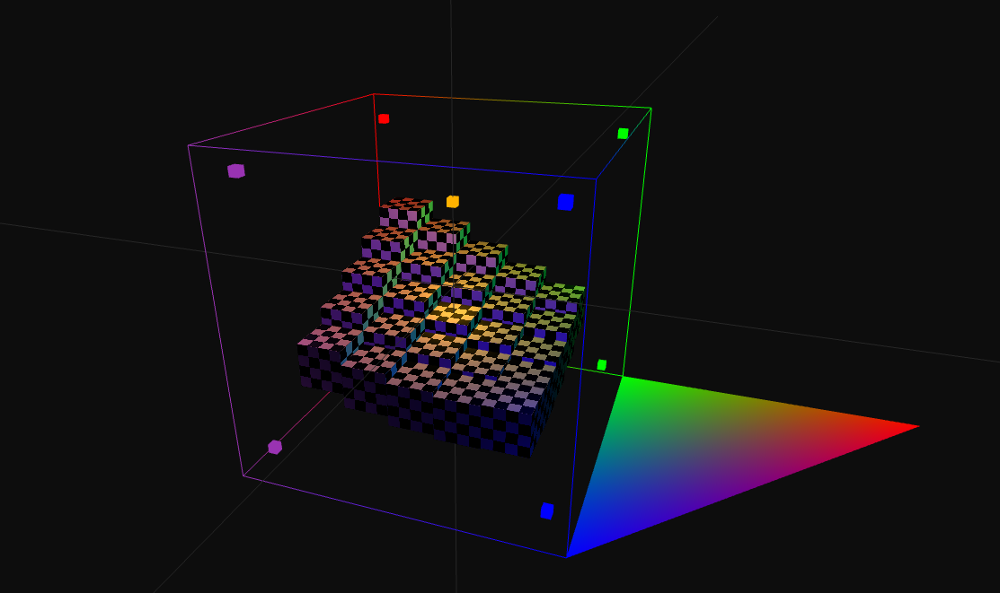

# MiteVox

<a href="LICENSE" >
    

        
    

</a>

MiteVox is an **Entity-Component-System**-based game engine. 
The engine is a result of experiments in Computer Graghics, Machine Learning and Computer Science in general. 

It consists of 8 modules:

- `engine/MiteVox` is the core of the engine. It defines the **entry point**.

- `engine/ECSManager` is a custom Entity-Component-System. It's minimalistic.

- `engine/Renderer` currently supports only **OpenGL**.

- `engine/FileIO` contains the implementation of an object that reads and parses files **asynchronously**.

- `engine/AIModels` implements **Perceptron + Backpropagation**, **Convolutional layer**, **Hopfield network**. 

- `engine/Physics` has an implementation of AABB collisions and defines rigid body.

- `engine/Math` contains a little bit of mathematics.

- `engine/UIEventHandler` has a basic user I/O setup. It definitely needs redesign...

The solution contains another project, that is not a part of the engine:

- `sandbox/DemoProject` is an example project.

## Potential use cases
:video_game: Sandbox games

:rocket: Approximate physics simulations

:robot: AI's virtual playground

## Screenshot

## Features & TODO
:warning: - TODO

### Custom project(s)
- engine_config.json
### MiteVox
- Scene
- Scene serialization: :warning:JSON, :warning:CBOR
### ECSManager
- Entity Component System
- Prefabs
- :warning:Hierarchy
### FileIO
- Asynchronous file loader & parser
- Graphics: PNG, OBJ, :warning:MTL
- Data interchange formats: JSON, :warning:CBOR
- Audio files: :warning:MP3
- Container formats: :warning:Ogg, :warning:ZIP
### Scripting
- Native (C++)
- :warning:Lua
### Math
- Data structures: Buffer, Half-table
- Linear algebra: Point3D, Vector3D, :warning:Matrices
- Numerical analysis:
  - Interpolation: Linear
- Graphs:
  - Trees: Binary search tree, Octree, :warning:Quad tree
- Noise: :warning:Perlin, :warning:OpenSimplex
### Renderer
- Primitives: Point, Line, Triangle
- :warning:Sprites
- Skybox
- Model3D
- Material:
  - Texture maps: Albedo, Roughness, Metallic, :warning:Normal, :warning:Glow
  - :warning:.mtl parser
- Camera:
  - :warning:Focal length
- :warning:Multiple cameras
- Lights: Ambient, Directional, Point light, :warning:Spot light
- Multiple lights
- :warning:PBR
### AIModels
- ML-models:
  - Feedforward Neural Networks
    - FullyConnectedLayer
    - Backpropagation for FullyConnectedLayer
    - :warning:ConvolutionalLayer2D
    - :warning:Backpropagation for ConvolutionalLayer2D
    - :warning:SubsamplingLayer2D
    - :warning:Backpropagation for SubsamplingLayer2D
    - SoftmaxLayer
  - Recurrent Neural Networks
    - HopfieldNetwork
  - :warning:NeuralNetwork (class that joins different types of NNs)
- Pathfinding:
  - :warning:A*
- :warning:StateMachine
### Physics
- Colliders:
  - Primitive collider
    - AABB intersection
    - :warning:SAT intersection
  - :warning:Mesh collider
- Structures: Rigid body, :warning:Atoms
- Classical mechanics: Kinematics, :warning:Dynamics, :warning:Statics

## :bug: Known bugs & limitations :bug:
- [X] ~~The project requires switching between release and debug via a flag~~.
- [ ] If you assign light position to a camera position, z-component needs to be negated (why?).
- [ ] .obj parser doesn't support polygon grouping by material.
- [ ] .obj parser doesn't support polygon grouping by smoothing.
- [ ] Binary search tree has global variables.
- [ ] Transform::getDirectionVector() + SpotLight doesn't work as expected.
- [ ] The project should be built with CMake.

## External dependencies (included)
- [-grey?style=flat&logo=github&logoColor=ffffff)](https://github.com/nigels-com/glew)
- [-grey?style=flat&logo=github&logoColor=ffffff)](https://github.com/glfw/glfw)
- [-grey?style=flat&logo=github&logoColor=ffffff)](https://github.com/g-truc/glm)
- SOIL (Simple OpenGL Image Library)

## References
- 
- 
- 
- 
- [-white?style=flat&logo=json&logoColor=000000)](https://www.ecma-international.org/publications-and-standards/standards/ecma-404/)
- 

